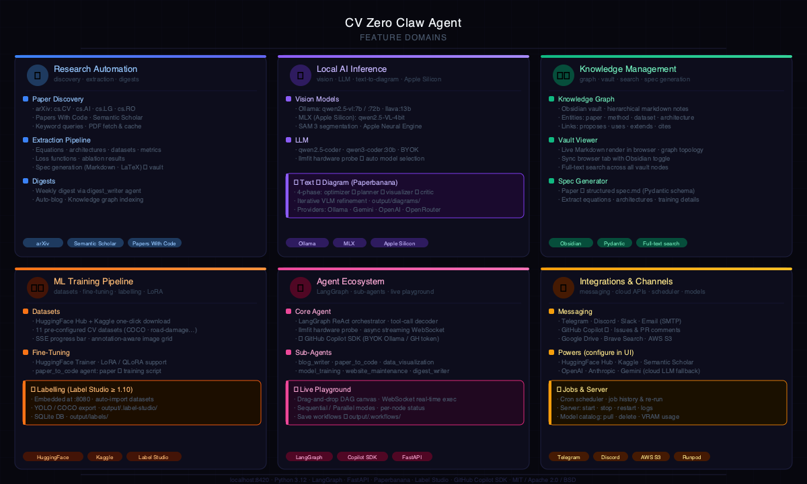
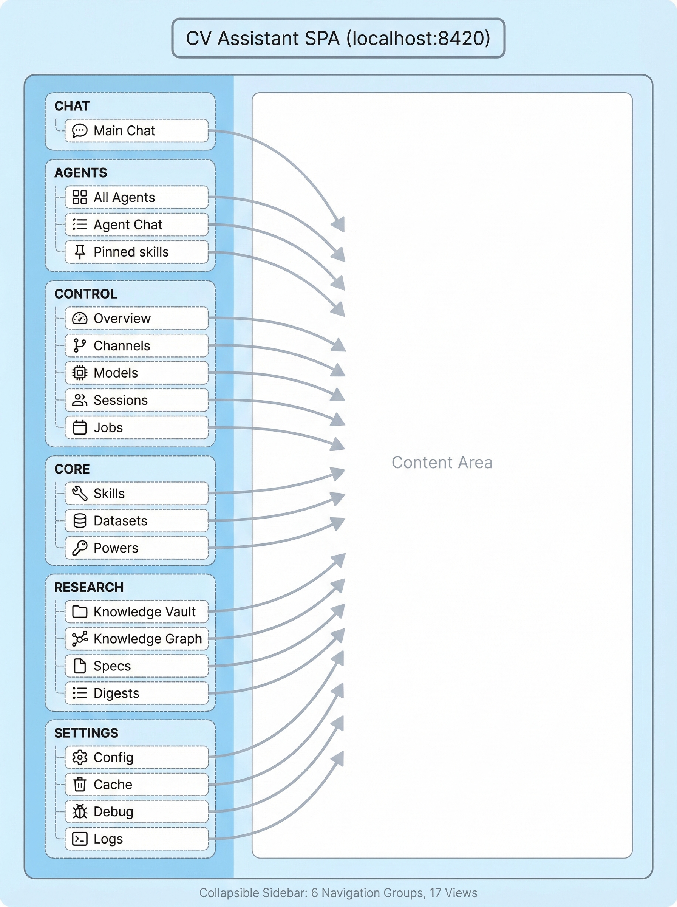
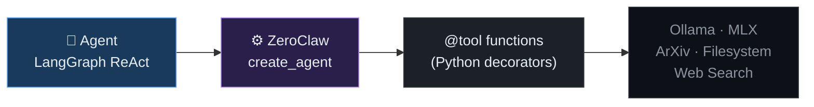

# Computer Vision Assistant 👁️

An autonomous Computer Vision research assistant — monitors arXiv, processes papers, builds knowledge graphs, generates specs, runs vision tasks locally via Ollama and MLX, manages local model weights, downloads training datasets, and fine-tunes models with HuggingFace Trainer. Powered by [ZeroClaw](https://github.com/zeroclaw-labs/zeroclaw).



---

## Architecture


| Tier | Components |
|------|-----------|
| **Web UI · :8420** | 💬 Chat · 📚 Vault Viewer · 📄 Specs · ⚡ Live Playground · 🏷️ Labelling · ⚙️ Config — FastAPI/Uvicorn |
| **Agent** | LangGraph ReAct orchestrator · llmfit hardware probe · `run_agent` entrypoint · LangChain tool decoder |
| **ZeroClaw tool layer** | `create_react_agent` · tool decoder · `web_search` · built-in tools |
| **CV Tools** | `analyze_image` · `segment_with_text` · `knowledge_graph` · `spec_generator` · `search_arxiv` · `run_ocr` · `label_studio` · **`text_to_diagram`** · sub-agents |
| **Paperbanana** | `text_to_diagram` → optimizer → planner (VLM) → visualizer (code gen) → critic (VLM review) × N → `output/diagrams/` |
| **Model Layer** | Vision: Ollama qwen2.5-vl / llava · MLX (Apple Silicon) · SAM 3 — LLM: qwen2.5-coder / qwen3-coder — Diagram: matplotlib · Gemini Imagen · OpenAI gpt-image-1 |
| **Copilot SDK** *(005)* | `CopilotManager` → `CopilotStreamBridge` → auto-wrapped `@tool` skills → BYOK Ollama `:11434/v1` |

**Paperbanana** (`text_to_diagram` tool) is a four-phase agentic pipeline: an *optimizer* enriches the input text, a VLM *planner* designs layout and elements, a code-gen *visualizer* renders the diagram (matplotlib locally or Imagen/DALL·E via cloud), and a VLM *critic* scores the result — looping back for refinement until the threshold is met. Supports Ollama, Gemini, OpenAI, OpenRouter, and Stability providers.

When `copilot.enabled: true` in `config/agent_config.yaml`, chat routes through the **Copilot SDK** path (dashed purple) instead of LangGraph. BYOK mode works with any OpenAI-compatible endpoint (Ollama) — no GitHub subscription required.

---

## Research → Knowledge Pipeline


---

## Hardware-Aware Model Selection


---

## Web UI

Single-page app at `http://localhost:8420` with a collapsible sidebar containing 6 navigation groups and 17 views.



---

## Navigation Views

### 💬 Chat

| View | Description |
|------|-------------|
| 💬 **Main Chat** | WebSocket chat with the main CV Assistant agent. Streaming responses, markdown + KaTeX math rendering, syntax-highlighted code blocks. Auto-resizes as the conversation grows. |

---

### 🤖 Agents

| View | Description |
|------|-------------|
| 🤖 **All Agents** | Card grid of specialized sub-agents — Blog Writer, Website Maintenance, Model Training, Data Visualization, Paper→Code. Click **Chat** on any card to open a dedicated conversation. |
| 💬 **Agent Chat** | Per-agent chat with the agent's name, model, and its own WebSocket endpoint (`/ws/agent/<id>`). Hidden in the sidebar until an agent is selected. |

---

### 🖥️ Control

| View | Description |
|------|-------------|
| 📊 **Overview** | System health summary: ZeroClaw status, Ollama connectivity, model readiness, and key metrics. |
| 🔗 **Channels** | Connect the assistant to messaging platforms (Telegram, Discord, Slack, Email). Push research updates, digests, and alerts to your preferred channel. |
| 🧠 **Models** | Three-section view for all local model infrastructure: |
| | &nbsp;&nbsp;**Server Management** — Start / Stop / Restart local inference servers (Image Gen on :7860, OCR on :7861, Ollama on :11434). Live Connected / Disconnected status badge, per-server device selector (GPU / CPU / Auto). |
| | &nbsp;&nbsp;**Model Management** — HuggingFace model catalog (SD-Turbo, SDXL-Turbo, Qwen-Image-2512, DeepGen 1.0, SAM 2/3, SVD, Monkey OCR). One-click download with live SSE progress bar, delete, and **Downloaded / Ready** badges. |
| | &nbsp;&nbsp;**Ollama** — Hardware detection via llmfit, list of pulled Ollama models, pull-by-tag input with auto-select, and llmfit-ranked model recommendations for the current hardware. |
| 📋 **Sessions** | Browse and manage active agent conversation sessions. |
| ⏰ **Jobs** | Scheduled and on-demand jobs: **Weekly Digest** (auto-runs every Monday) and **Model Fine-Tuning** (configure base model, dataset, columns, epochs, LR, batch size; streams training output via SSE). |

---

### ⚡ Core

| View | Description |
|------|-------------|
| ⚡ **Skills** | Grid of composable capabilities grouped by category (Vision, Content, Research, ML/Training). Each card shows status — ✅ Ready, 📦 Needs Install (with `pip install` command), or ⚡ Needs Power. Clicking a skill opens its dedicated sub-view (e.g., **Text→Diagram**). |
| 🗂️ **Datasets** | Search bar (HuggingFace or Kaggle) with live results showing download count, tags, and size. Pre-configured catalog of 11 datasets — one-click download with SSE progress bar. Downloaded datasets show a 🔬 **Visualize** button that opens an annotation-aware image grid with split tabs, pagination, and lightbox. |
| 🔌 **Powers** | External integrations and API keys (HuggingFace Hub, Kaggle, Email SMTP, GitHub, Brave Search, Semantic Scholar, etc.). Configure credentials directly from the UI — no manual `.env` editing required. Active powers unlock additional Skills. |

---

### 🔬 Research

| View | Description |
|------|-------------|
| 🗂️ **Knowledge Vault** | Split-view browser for the Obsidian vault: left panel is a collapsible file tree of markdown notes, right panel renders the selected note with syntax highlighting and math. |
| 🕸️ **Knowledge Graph** | Canvas-based interactive graph of connections between papers, concepts, equations, and specs. Nodes are draggable; edges show relationships. Displays node/edge count. |
| 📝 **Specs** | Split-view: left panel lists all generated `spec.md` files by paper, right panel renders the selected spec with a **Raw** toggle for the source markdown. |
| 📰 **Digests** | Split-view: left panel lists weekly digest files, right panel renders the selected digest as formatted markdown. |
| ⚡ **Playground** | Graphical block-based pipeline builder. Drag skill blocks onto a canvas, wire them together, configure parameters inline, and execute DAG pipelines with per-node streaming status. Pipelines are saved to and loaded from `output/.workflows/`. Toggle with `Cmd/Ctrl+Shift+P`. |
| 🏷️ **Labelling** | Embedded Label Studio annotation platform. One-click start/stop of a managed Label Studio subprocess (port 8080), with the annotation workspace loaded directly in the sidebar via iframe. Supports bounding boxes, polygons, keypoints, and segmentation masks. Includes SSE import progress, COCO/YOLO/VOC export, and DAG workflow node integration via a Mark Complete button. |

---

### ⚙️ Settings

| View | Description |
|------|-------------|
| ⚙️ **Config** | **ZeroClaw Status** card (library version, registered tools) and **Agent Configuration** card (full rendered view of the loaded `agent_config.yaml`). |
| 💾 **Cache** | Disk-backed LLM response cache: entry count, total disk usage, and per-entry breakdown. **Clear Expired** removes stale entries without touching live cache. |
| 🔧 **Debug** | Internal diagnostic information: loaded config values, environment flags, and runtime state. |
| 📄 **Logs** | Live server log output streamed to the browser with auto-scroll, **Clear**, and **Refresh** controls. |

---

## CV Playground

The Playground is a **graphical pipeline builder** — a collapsible right sidebar that sits alongside the live chat. Open it from the Research nav group (⚡ Playground) or press `Cmd/Ctrl+Shift+P`.

### How it works

1. **Browse skills** — the left column lists every registered tool and agent as a draggable block, grouped by category (Vision, Research, Content, Agents, Utility) with a real-time search filter.
2. **Build a pipeline** — drag blocks onto the canvas; connect an output port to an input port to form a directed edge. The canvas prevents cycles (any edge that would create one is rejected with a toast).
3. **Configure blocks** — click any block to open the parameter flyout panel on the right; fill in model names, prompts, thresholds, or any schema-defined field. Required fields missing at run time are highlighted in yellow.
4. **Add Inputs / Outputs** — the special **Inputs** block defines pipeline entry values (image path, text, URL, etc.); the **Outputs** block captures the final result.
5. **Run** — click **▶ Run**; the pipeline POSTs to `/api/pipelines/run`, receives a `run_id`, then opens a WebSocket stream. Each block cycles through: ⬜ Pending → 🔵 Running → 🟢 Done / 🔴 Error. Results stream into the chat panel labelled `[Pipeline · <skill>]`.
6. **Undo / Redo** — `Cmd/Ctrl+Z` / `Cmd/Ctrl+Y` with a 50-step snapshot history.
7. **Save / Load** — name and save a pipeline; reload it from the dropdown or from the Workflows nav section via **Open in Playground →**.

### Skill block categories

| Category | Example blocks |
|----------|---------------|
| Vision | analyze\_image, run\_ocr, segment\_with\_text |
| Research | search\_arxiv, fetch\_arxiv\_paper, generate\_spec |
| Content | draft\_blog\_post, text\_to\_diagram |
| Agents | delegate\_blog\_writer, delegate\_paper\_to\_code, delegate\_data\_visualization, delegate\_model\_training, delegate\_website\_maintenance, delegate\_digest\_writer |
| Utility | shell, file\_read, web\_search |
| Special | Inputs, Outputs |

### Key files

| Component | File |
|-----------|------|
| DAG runner | `src/cv_agent/pipeline/dag_runner.py` |
| Pydantic models | `src/cv_agent/pipeline/models.py` |
| Skill registry adapter | `src/cv_agent/pipeline/skill_registry.py` |
| REST endpoints | `src/cv_agent/web.py` (search `# CV-Playground`) |
| Frontend JS | `src/cv_agent/ui/app.js` (search `initPlayground`) |
| Frontend HTML | `src/cv_agent/ui/index.html` (search `playground-panel`) |
| Frontend CSS | `src/cv_agent/ui/style.css` (search `CV Playground`) |
| Saved pipelines | `output/.workflows/*.json` |

---

## Live Playground

The **Live Playground** adds real-time per-node status streaming to every pipeline run. A persistent badge in the sidebar nav shows pipeline activity at a glance — toggle it with `Cmd/Ctrl+Shift+P` or click ⚡ Playground in the Research group.


### How live execution works

1. Click **▶ Run** — the pipeline POSTs to `/api/pipelines/run` and receives a `run_id`
2. A WebSocket opens at `/ws/workflows/{run_id}` and streams `node_status` events as each block executes
3. Node borders update in real time: ⬜ Pending → 🔵 Running (pulsing) → 🟢 Done → 🔴 Error
4. The sidebar **Live** badge pulses orange during execution and turns solid green on completion
5. Results appear inline in each node's output panel as they arrive — no page reload needed

### Key files

| Component | File |
|-----------|------|
| Live badge | `src/cv_agent/ui/index.html` (search `live-badge`) |
| Status WebSocket listener | `src/cv_agent/ui/app.js` (search `_playgroundLiveWs`) |
| WebSocket endpoint | `src/cv_agent/web.py` (search `/ws/workflows`) |
| Node status events | `src/cv_agent/pipeline/dag_runner.py` |

---

## Labelling

The **Labelling** view integrates [Label Studio](https://github.com/HumanSignal/label-studio) (Apache 2.0) as a fully managed annotation platform — no separate installation or manual setup required.


### How it works

1. **Start** — click **▶ Start** in the Labelling sidebar view; the agent launches Label Studio as a subprocess on port 8080 (configurable via `LABEL_STUDIO_PORT`). The first run takes ~60 s for Django migrations; subsequent starts are instant.
2. **Annotate** — the Label Studio workspace loads directly in the sidebar via iframe (`/user/login/`). Every project includes all four annotation types (bounding box, polygon, keypoint, segmentation mask) so config is never locked after annotations are created.
3. **Import** — images upload in the background via SSE; a live progress bar shows `n / total` files as they are indexed.
4. **Export** — trigger COCO JSON, YOLO TXT, or Pascal VOC XML export from the agent; the file is written to `output/labels/{date}_{dataset}/{format}/{project_id}.{ext}`.
5. **DAG node** — use `create_labelling_dag_node` in a workflow to pause a pipeline at a labelling step. A **Mark Complete** button appears in the sidebar; clicking it triggers auto-export and signals the next DAG node.

### Agent tools

| Tool | Description |
|------|-------------|
| `start_labelling_server` | Start Label Studio and wait up to 60 s for ready |
| `create_labelling_project` | Create a project; optionally import images immediately |
| `list_labelling_projects` | List all projects with task and annotation counts |
| `export_annotations` | Export to COCO / YOLO / VOC; writes to `output/labels/` |
| `create_labelling_dag_node` | Register a labelling checkpoint in a workflow DAG |

### REST endpoints

| Method | Path | Description |
|--------|------|-------------|
| `POST` | `/api/labelling/start` | Start Label Studio; polls health for up to 60 s |
| `POST` | `/api/labelling/stop` | Stop Label Studio and disable auto-restart |
| `GET` | `/api/labelling/status` | Returns `not_installed` / `stopped` / `starting` / `ready` |
| `POST` | `/api/labelling/install` | SSE stream — install `label-studio` into the venv |
| `POST` | `/api/labelling/projects` | Create a new project |
| `GET` | `/api/labelling/projects` | List all projects |
| `GET` | `/api/labelling/projects/{id}/import-stream` | SSE — stream per-file import progress |
| `POST` | `/api/labelling/projects/{id}/export` | Trigger export and write to `output/labels/` |
| `GET` | `/api/labelling/nodes` | List pending DAG labelling nodes |
| `POST` | `/api/labelling/complete/{node_id}` | Mark node complete; triggers auto-export |

### Configuration

| Variable | Default | Description |
|----------|---------|-------------|
| `LABEL_STUDIO_PORT` | `8080` | Port Label Studio binds to |
| `LABEL_STUDIO_TOKEN` | *(empty)* | API token (optional for local use) |
| `OUTPUT_DIR` | `./output` | Base dir for `.label-studio/` data and exports |

### Key files

| Component | File |
|-----------|------|
| REST client | `src/cv_agent/labelling_client.py` |
| Agent tools | `src/cv_agent/tools/labelling.py` |
| API endpoints | `src/cv_agent/web.py` (search `# ── Labelling`) |
| Server lifecycle | `src/cv_agent/server_manager.py` (`register_label_studio`) |
| Frontend | `src/cv_agent/ui/index.html` (`view-labelling`) · `app.js` (`loadLabellingView`) |
| Annotations output | `output/labels/{YYYY-MM-DD}_{dataset}/{coco\|yolo\|voc}/` |
| Label Studio DB | `output/.label-studio/` *(gitignored)* |

---

## Concepts

### 🤖 Models

Model weights that power intelligent inference. Three categories live in this project:

| Type | Where | Examples |
|------|-------|---------|
| **Ollama models** | Pulled via `ollama pull` | qwen2.5vl, qwen3-vl, olmocr2 (VLMs / LLMs) |
| **Local HF models** | Downloaded to `output/.models/` | SD-Turbo, SDXL-Turbo, Qwen-Image-2512, DeepGen 1.0, SAM 2/3, Monkey OCR 1.5, SVD/SVD-XT, PaddleOCR |
| **pip-based models** | Auto-download on first use | PaddleOCR |

#### Local Model Catalog

| Category | Model | HF Repo | Size |
|----------|-------|---------|------|
| Image Generation | SD-Turbo | `stabilityai/sd-turbo` | 4.8 GB |
| Image Generation | SDXL-Turbo | `stabilityai/sdxl-turbo` | 6.5 GB |
| Image Generation | Qwen-Image-2512 | `Qwen/Qwen-Image-2512` | 57.7 GB |
| Image Generation | DeepGen 1.0 | `deepgenteam/DeepGen-1.0` | 16.4 GB |
| Video Generation | Stable Video Diffusion | `stabilityai/stable-video-diffusion-img2vid` | 9.2 GB |
| Video Generation | SVD-XT (25 frames) | `stabilityai/stable-video-diffusion-img2vid-xt` | 9.2 GB |
| OCR | Monkey OCR 1.5 | `echo840/MonkeyOCR` | 8.0 GB |
| OCR | PaddleOCR | pip package | 0.5 GB |
| Segmentation | SAM 3 | `facebook/sam3` | 6.9 GB |
| Segmentation | SAM 2.1 Large | `facebook/sam2.1-hiera-large` | 2.5 GB |
| Segmentation | SAM 2.1 Small | `facebook/sam2.1-hiera-small` | 0.2 GB |
| Segmentation | SAM 2 Large | `facebook/sam2-hiera-large` | 2.5 GB |
| Segmentation | SAM 2 Base+ | `facebook/sam2-hiera-base-plus` | 0.8 GB |

Models are managed from the **Models** view — pull Ollama models, download HuggingFace weights, track disk usage, and monitor health of local inference servers. Downloads stream progress via SSE and resume automatically after interruption.

---

### 🗂️ Datasets

A built-in dataset catalog lets you download training and evaluation datasets directly from HuggingFace with one click, or search for any dataset across HuggingFace and Kaggle.

#### Pre-configured Dataset Catalog (11 datasets)

| Category | Dataset | Source | Size |
|----------|---------|--------|------|
| Image Classification | Food-101 | `food101` | 5.6 GB |
| Image Classification | Oxford-IIIT Pets | `pcuenq/oxford-pets` | 0.8 GB |
| Image Classification | CIFAR-100 | `uoft-cs/cifar100` | 0.5 GB |
| Image Classification | Flowers-102 | `nelorth/oxford-flowers` | 0.4 GB |
| Image Classification | Beans | `AI-Lab-Makerere/beans` | 0.1 GB |
| Object Detection | WIDER FACE | `CASIA-IVA-Lab/WIDER_FACE` | 3.5 GB |
| Object Detection | Pascal VOC 2007 | `Graphcore/voc2007` | 0.9 GB |
| Segmentation | Sidewalk Semantic | `segments/sidewalk-semantic` | 0.3 GB |
| Segmentation | ADE20K (Scene Parse 150) | `zhoubolei/scene_parse_150` | 0.8 GB |
| Document / OCR | DocVQA Sample | `nielsr/docvqa_1200_examples` | 0.2 GB |
| Document / OCR | SROIE Receipt OCR | `darentang/sroie` | 0.1 GB |

**Search**: type any query in the Datasets search bar and switch between HuggingFace or Kaggle sources. Results show download count, likes, tags, and size. HuggingFace results can be downloaded directly into `output/.datasets/` with live progress streaming. All datasets use a `.complete` sentinel file to track completion and support reliable resume.

---

### ⚡ Skills

A **Skill** is a named, composable capability built from one or more of:

- **Models** — AI/ML weights that provide intelligence (e.g. SAM 3 for segmentation, SD-Turbo for generation)
- **Algorithms** — Classical CV methods (e.g. feature matching for stitching, RANSAC, optical flow)
- **Open-source libraries** — MIT / Apache 2.0 / BSD-3 only (e.g. `kornia`, `diffusers`, `supervision`, `torchvision`)
- **Powers** *(optional)* — External integrations needed for some skills (e.g. HuggingFace token, Email SMTP)

Skills show three states in the UI:

| Badge | Meaning |
|-------|---------|
| ✅ **Ready** | All dependencies and powers present — skill is fully operational |
| 📦 **Needs Install** | Missing a Python package — shown with `pip install …` command |
| ⚡ **Needs Power** | Requires an external integration or API key to be configured |

**Current skill catalogue:**

| Icon | Skill | Category | Powered By | Status |
|------|-------|----------|-----------|--------|
| 🖼️ | 2D Image Processing | Vision | Pillow · OpenCV (Apache 2.0) | ✅ Ready |
| 🧊 | 3D Image Processing | Vision | open3d · trimesh (MIT/Apache) | 📦 `pip install open3d` |
| 🎥 | Video Understanding | Vision | opencv-python · decord (Apache 2.0) | 📦 `pip install opencv-python` |
| 🧩 | Image Stitching | Vision | OpenCV Stitcher (Apache 2.0) | 📦 `pip install opencv-python` |
| 🎯 | Object Detection | Vision | torchvision (BSD-3) · transformers RT-DETR | 📦 `pip install torchvision` |
| 📡 | Object Tracking | Vision | supervision + ByteTrack/SORT (MIT) | 📦 `pip install supervision` |
| 🖼️ | Text → Image | Vision | diffusers (Apache 2.0) + SD-Turbo / SDXL-Turbo | 📦 `pip install diffusers` |
| 🔭 | Super Resolution | Vision | spandrel (MIT) — ESRGAN · SwinIR · HAT | 📦 `pip install spandrel` |
| ✨ | Image Denoising | Vision | kornia (Apache 2.0) | 📦 `pip install kornia` |
| 📄 | Image Document Extraction | Vision | Monkey OCR 1.5 · PaddleOCR fallback | ✅ Ready |
| ✍️ | Write Research Blog | Content | search_arxiv · web_search · file_write | ✅ Ready |
| 📰 | Weekly Digest | Content | search_arxiv · web_search · file_write | ✅ Ready |
| 📧 | Email Reports | Content | SMTP | ⚡ Needs Power (Email) |
| 📋 | Paper → Spec | Research | fetch_arxiv_paper · extract_equations | ✅ Ready |
| 🕸️ | Knowledge Graph | Research | Obsidian vault · graph.py | ✅ Ready |
| ∑ | Equation Extraction | Research | LaTeX parser · PDF tools | ✅ Ready |
| 🧭 | Text → Diagram | Research | paperbanana · Ollama · matplotlib | 📦 `pip install -e paperbanana/` |
| 🏷️ | Labelling | Vision | Label Studio ≥ 1.10 (Apache 2.0) | 📦 `pip install label-studio` (auto-installs via UI) |
| 🏆 | Kaggle Competition | ML / Training | Kaggle API | ⚡ Needs Power (Kaggle) |
| 🎯 | Model Fine-Tuning | ML / Training | HuggingFace Trainer (local) | ✅ Ready (with HF_TOKEN) |
| 📊 | Dataset Analysis | ML / Training | shell · file_read · analyze_image | ✅ Ready |


---

### 🔌 Powers

A **Power** is an external resource, integration, or API key that extends what the agent can access. Powers are configured from the **Powers** view — no manual `.env` editing required.

---

### ⚙️ Jobs

The **Jobs** view provides scheduled tasks and one-click runs:

| Job | Type | Description |
|-----|------|-------------|
| 📰 Weekly Digest | Scheduled | Auto-generates a weekly CV research digest every Monday |
| 🎯 Model Fine-Tuning | On-demand | Configure and launch a HuggingFace Trainer fine-tuning run locally |

**Model Fine-Tuning job**: select any HF base model (default: `google/vit-base-patch16-224`), a downloaded dataset, image/label column names, epochs, learning rate, and batch size. The job generates a full training script, streams live output via SSE, and saves the fine-tuned model to `output/fine-tuned/<name>/`.

---

### 🖥️ Server Management

The **Models** view includes a server management panel for local inference servers (non-Ollama):

| Server | URL | Notes |
|--------|-----|-------|
| Ollama | `http://localhost:11434` | Managed externally — always shown |
| Image Generation | `http://localhost:7860` | Start/stop; device: GPU / CPU / Auto |
| OCR Service | `http://localhost:7861` | Start/stop; device: CPU |
| Label Studio | `http://localhost:8080` | Start/stop from Labelling view; auto-restarts on crash |

Each server shows a live Connected / Disconnected status badge and supports Restart, Stop, and device-selector controls.

---

## Agents

Agents are standalone, focused AI workers — each with its own system prompt, curated tool set, and dedicated WebSocket endpoint (`/ws/agent/<id>`).

| Icon | Agent | Description | Status |
|------|-------|-------------|--------|
| ✍️ | **Blog Writer** | Writes research blog posts from papers, summaries, or topics. | ✅ Ready |
| 🌐 | **Website Maintenance** | Audits sites for broken links, uptime, and on-page SEO issues. | ✅ Ready |
| 🏋️ | **Model Training** | Generates training configs, cost estimates, and full training scripts. | ✅ Ready |
| 📊 | **Data Visualization** | Generates matplotlib/plotly chart code from metrics and papers. | ✅ Ready |
| 📄→💻 | **Paper to Code** | Scaffolds complete PyTorch implementations from ArXiv papers. | ✅ Ready |

Each agent is accessible via:
- **Web UI** — select from the sidebar Agents view
- **WebSocket** — `ws://localhost:8420/ws/agent/<id>`
- **REST** — `GET /api/agents` lists all; `GET /api/agents/<id>` returns details
- **Main agent delegation** — the main agent auto-delegates via `delegate_<agent>` tools

Per-agent model overrides: set `BLOG_WRITER_MODEL`, `WEBSITE_AGENT_MODEL`, `TRAINING_AGENT_MODEL`, `VIZ_AGENT_MODEL`, or `PAPER_TO_CODE_MODEL` in `.env`.

---

## Powers

### 🔌 Built-in (always available)

| Icon | Power | Status | Notes |
|------|-------|--------|-------|
| 🔍 | Internet Search | ✅ Active | DuckDuckGo by default; set `BRAVE_API_KEY` for higher quality |
| 📁 | Local File System | ✅ Active | `file_read`, `file_write`, `shell` via ZeroClaw |
| 📚 | ArXiv | ✅ Active | Free public API — no key required |
| 🔬 | Semantic Scholar | ⚠️ Limited | Rate-limited; set `SEMANTIC_SCHOLAR_API_KEY` for full access |
| 🖼️ | 2D Image Processing | ✅ Active | Pillow + OpenCV |
| 🧊 | 3D Image Processing | 📦 Install | Requires `open3d` |

### 🔗 Integrations (configure in Powers view)

| Icon | Power | Env Var | Unlocks |
|------|-------|---------|---------|
| 📧 | Email (SMTP) | `SMTP_HOST`, `SMTP_USER`, `SMTP_PASSWORD` | Email Reports skill |
| 🤗 | HuggingFace Hub | `HF_TOKEN` | Gated model downloads (SAM 3, DeepGen), dataset search |
| 🏆 | Kaggle | `KAGGLE_USERNAME`, `KAGGLE_KEY` | Kaggle Competition skill, Kaggle dataset search |
| 🐙 | GitHub | `GITHUB_TOKEN` | GitHub repo access |
| 🔤 | OCR | `OCR_ENGINE` | Document Text Extraction skill |
| 🎬 | Vid-LLMs | `VID_LLM_MODEL` | Video Understanding skill |

### ☁️ Cloud Compute

| Icon | Power | Env Var |
|------|-------|---------|
| ☁️ | Azure ML | `AZURE_SUBSCRIPTION_ID`, `AZURE_ML_WORKSPACE` |
| 🚀 | RunPod | `RUNPOD_API_KEY` |

---

## ZeroClaw Integration

ZeroClaw is the **tool execution layer** between the agent orchestrator and CV tools.



**Current status:** `zeroclaw-tools` is not yet on PyPI. A local shim at `src/zeroclaw_tools/__init__.py` provides the identical API surface via LangChain + LangGraph. When the package ships:

```bash
pip install zeroclaw-tools
rm -rf src/zeroclaw_tools/   # zero other changes required
```

---

## Quick Start

### Prerequisites

- Python 3.12+
- [Ollama](https://ollama.ai) running locally
- macOS Apple Silicon recommended (Metal acceleration via MLX)
- [llmfit](https://github.com/AlexsJones/llmfit) for hardware detection: `brew install llmfit`

### Setup

```bash
git clone https://github.com/kp-algomaster/ComputerVision-Assistant
cd ComputerVision-Assistant

python -m venv .venv
source .venv/bin/activate

pip install -e ".[dev]"

cp .env.example .env   # add API keys
```

> **ZeroClaw shim:** `zeroclaw-tools` is not yet on PyPI. The repo ships a local compatibility shim at `src/zeroclaw_tools/` that provides the identical `@tool` / `create_agent` API via LangChain + LangGraph in pure Python. Once the real high-performance Rust-backed package is published, replace with `pip install zeroclaw-tools` and delete `src/zeroclaw_tools/` to transparently unlock native memory efficiency and performance gains while keeping zero code changes.

### Launch

```bash
source .venv/bin/activate
cv-agent ui
# → http://127.0.0.1:8420

# Or with uvicorn directly
uvicorn cv_agent.web:create_app --factory --host 127.0.0.1 --port 8420 --app-dir src
```

### CLI Commands

```bash
cv-agent start                                     # interactive terminal agent
cv-agent paper https://arxiv.org/abs/2312.00785 --spec  # process a paper
cv-agent digest --week                             # generate weekly digest
cv-agent vision analyze path/to/image.png          # analyse an image
cv-agent knowledge sync                            # sync knowledge graph
```

---

## Project Structure

```
CV_Zero_Claw_Agent/
├── src/
│   ├── cv_agent/
│   │   ├── agent.py                  # Agent orchestrator + LangGraph ReAct loop
│   │   ├── cli.py                    # Click CLI entry point
│   │   ├── web.py                    # FastAPI server + all API endpoints
│   │   ├── config.py                 # Pydantic config (AgentConfig, LlmfitConfig)
│   │   ├── local_model_manager.py    # HF model catalog, download (SSE), delete
│   │   ├── dataset_manager.py        # Dataset catalog, HF download (SSE), delete
│   │   ├── server_manager.py         # Local inference server start/stop/health
│   │   ├── ui/
│   │   │   ├── index.html            # SPA shell (nav + playground panel)
│   │   │   ├── style.css             # Dark theme (GitHub-inspired) + Playground styles
│   │   │   └── app.js                # View routing, chat WS, all loaders, Playground JS
│   │   ├── pipeline/
│   │   │   ├── dag_runner.py         # Async DAG executor (topological sort, fan-out)
│   │   │   ├── models.py             # PipelineGraph, BlockInstance, Edge Pydantic models
│   │   │   └── skill_registry.py     # Adapter: build_tools() → playground skill list
│   │   ├── servers/
│   │   │   ├── img_gen.py            # Image generation server stub (FastAPI :7860)
│   │   │   └── ocr_server.py         # OCR server stub (FastAPI :7861)
│   │   ├── tools/
│   │   │   ├── vision.py             # Ollama vision tools
│   │   │   ├── mlx_vision.py         # MLX-accelerated vision (Apple Silicon)
│   │   │   ├── paper_fetch.py        # ArXiv / paper fetching
│   │   │   ├── equation_extract.py   # LaTeX equation extraction
│   │   │   ├── knowledge_graph.py    # Obsidian knowledge graph
│   │   │   ├── spec_generator.py     # Paper → spec.md pipeline
│   │   │   ├── hardware_probe.py     # llmfit integration + Ollama management
│   │   │   └── remote.py             # Telegram / Discord / messaging
│   │   ├── research/
│   │   │   ├── monitor.py            # Source monitoring scheduler
│   │   │   ├── digest.py             # Weekly digest generator
│   │   │   └── sources.py            # ArXiv / PWC / Semantic Scholar config
│   │   └── knowledge/
│   │       ├── graph.py              # Graph core logic
│   │       └── obsidian.py           # Obsidian vault writer
│   └── zeroclaw_tools/
│       └── __init__.py               # ZeroClaw shim (delete when PyPI pkg ships)
├── config/
│   └── agent_config.yaml             # Full agent configuration
├── vault/                            # Obsidian knowledge vault output
├── output/
│   ├── .models/                      # Local HF model weights
│   ├── .datasets/                    # Downloaded training datasets
│   ├── .workflows/                   # Saved Playground pipelines (JSON)
│   ├── fine-tuned/                   # Fine-tuning run outputs
│   └── diagrams/                     # Text→Diagram outputs
└── .env                              # Secrets (gitignored)
```

---

## API Reference

### Models

| Method | Path | Description |
|--------|------|-------------|
| `GET` | `/api/local-models/catalog` | List all models with download status |
| `POST` | `/api/local-models/{id}/download` | SSE stream — download model from HF Hub |
| `DELETE` | `/api/local-models/{id}` | Delete local model files |
| `GET` | `/api/local-servers` | List inference servers with health status |
| `POST` | `/api/local-servers/{id}/start` | Start a managed server process |
| `POST` | `/api/local-servers/{id}/stop` | Stop a managed server process |
| `POST` | `/api/local-servers/{id}/restart` | Restart a managed server |
| `PATCH` | `/api/local-servers/{id}` | Update device setting |

### Datasets

| Method | Path | Description |
|--------|------|-------------|
| `GET` | `/api/datasets` | List catalog datasets with download status |
| `GET` | `/api/datasets/search?q=&source=` | Search HuggingFace or Kaggle |
| `POST` | `/api/datasets/{id}/download` | SSE stream — download dataset from HF Hub |
| `POST` | `/api/datasets/add-external` | SSE stream — download any HF dataset by repo ID |
| `DELETE` | `/api/datasets/{id}` | Delete local dataset files |

### Jobs

| Method | Path | Description |
|--------|------|-------------|
| `GET` | `/api/cron` | List all scheduled and on-demand jobs |
| `POST` | `/api/jobs/fine-tune/run` | SSE stream — run HuggingFace Trainer fine-tuning |

### Skills & Powers

| Method | Path | Description |
|--------|------|-------------|
| `GET` | `/api/skills` | List all skills with status |
| `GET` | `/api/powers` | List all powers with configuration status |
| `POST` | `/api/powers/{id}/configure` | Save power credentials to `.env` |

### Playground & Pipelines

| Method | Path | Description |
|--------|------|-------------|
| `GET` | `/api/playground/skills` | List all skill blocks (name, category, parameter schema) |
| `POST` | `/api/pipelines/run` | Execute a pipeline DAG; returns `run_id` + WebSocket URL |
| `POST` | `/api/pipelines` | Save a named pipeline to `output/.workflows/` |
| `GET` | `/api/pipelines` | List all saved pipelines |
| `GET` | `/api/pipelines/{id}` | Load a saved pipeline by name |
| `DELETE` | `/api/pipelines/{id}` | Delete a saved pipeline |
| `WS` | `/ws/workflows/{run_id}` | Stream per-node status events (`node_status`, `node_output`, `pipeline_done`) |

---

## Configuration

### Environment Variables (`.env`)

| Variable | Default | Description |
|----------|---------|-------------|
| `OLLAMA_HOST` | `http://localhost:11434` | Ollama server URL |
| `LLM_MODEL` | `qwen3.5:9b` | LLM model tag |
| `OLLAMA_VISION_MODEL` | `qwen2.5-vl:7b` | Vision model tag |
| `LLM_BASE_URL` | `http://localhost:11434/v1` | OpenAI-compatible base URL |
| `CV_SSL_VERIFY` | `false` | Verify TLS certificates for outbound HTTP(S); set `false` for self-signed chains or set a PEM bundle path |
| `HF_TOKEN` | — | HuggingFace Hub token (required for gated models: SAM 3, DeepGen 1.0) |
| `BRAVE_API_KEY` | — | Brave Search (upgrades web search quality) |
| `SEMANTIC_SCHOLAR_API_KEY` | — | Removes rate limits on paper search |
| `KAGGLE_USERNAME` / `KAGGLE_KEY` | — | Kaggle competition tools + dataset search |
| `GITHUB_TOKEN` | — | GitHub repo access |
| `SMTP_HOST` / `SMTP_USER` / `SMTP_PASSWORD` | — | Email power |
| `VAULT_PATH` | `./vault` | Obsidian vault output path |

Full configuration reference: [`config/agent_config.yaml`](config/agent_config.yaml)

---

## License

This project is licensed under the **MIT License** — see the [LICENSE](LICENSE) file for full terms.

```
MIT License  Copyright (c) 2026 kp-algomaster
```

You are free to use, modify, and distribute this software for any purpose, including commercial use, with no warranty. Attribution appreciated but not required.

### Third-party notices

| Dependency | License |
|------------|---------|
| [LangChain](https://github.com/langchain-ai/langchain) | MIT |
| [LangGraph](https://github.com/langchain-ai/langgraph) | MIT |
| [FastAPI](https://github.com/tiangolo/fastapi) | MIT |
| [Ollama](https://github.com/ollama/ollama) | MIT |
| [llmfit](https://github.com/AlexsJones/llmfit) | Apache 2.0 |
| [MLX](https://github.com/ml-explore/mlx) | MIT |
| [Pydantic](https://github.com/pydantic/pydantic) | MIT |
| [HuggingFace Hub](https://github.com/huggingface/huggingface_hub) | Apache 2.0 |
| [Drawflow](https://github.com/jerosoler/Drawflow) | MIT |
| [Label Studio](https://github.com/HumanSignal/label-studio) | Apache 2.0 |

> **Model licenses** vary by provider. Check the model card on [HuggingFace](https://huggingface.co) or [Ollama Hub](https://ollama.com/library) before commercial use.
